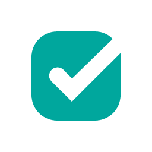
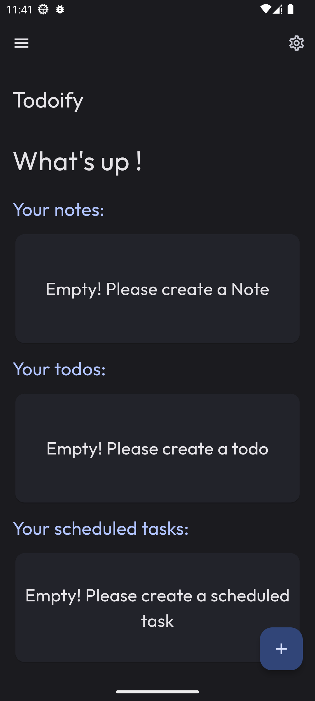
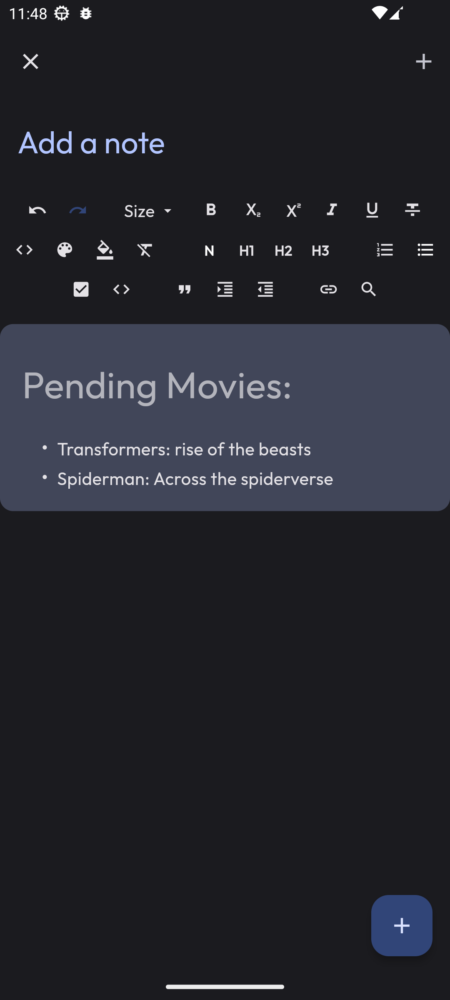
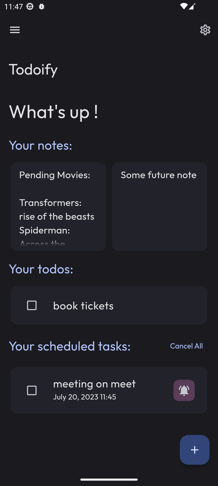
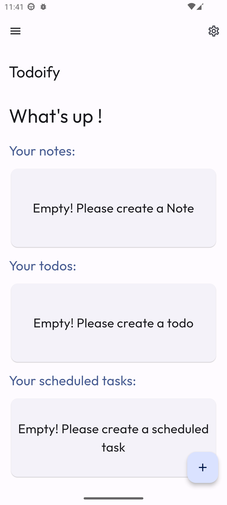
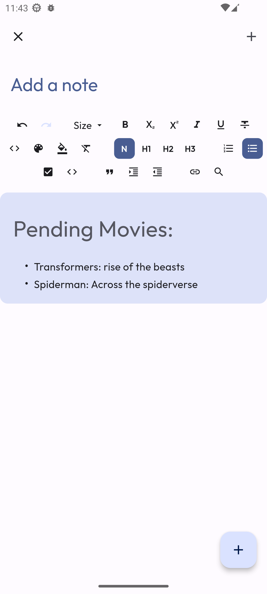
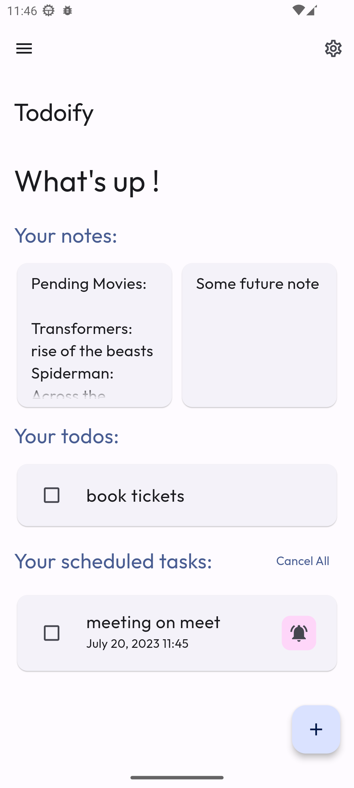

   
   <h1>Todoify</h1>
   
a material design, <strong>closed source offline based todo, notetaking app</strong> for android with <strong>Material You</strong> theming.

## Donation:

## Downloads:

## Features:

-  Proper material design (MD3) with support for **_material you design_**
-  Custom accent colours when dynamic colours are off.
-  Fully **_offline based_** todo & note-taking app
-  **Simple and easy-to-use UI** of creating new todos, notes, and future/scheduled tasks.
-  Swipe from left to edit any todo/scheduled task and swipe from right to delete a todo/scheduled task.
-  Ability to **create notes with full markdown and editing support**
-  Tap to view notes and on long press to delete them
-  Ability to create **future/scheduled** tasks.
-  Ability to set a **reminder notification** for future/scheduled notes
-  Ability to add scheduled task to the device calendar.
-  Ability to change font from Google fonts.
-  Monet-based splash screen for Android 12+ devices.
-  Monochrome icon for Android 13+ devices.
-  Theme switcher (Light, dark and AMOLED/black mode)

> Note:
>
> -  Android 12 & above will extract colors from wallpaper set on your device
> -  Other android versions uses accent colors within app to match material you system.

---

## General Information:

-  You can find all the releases in the releases section.
-  You can also create issues and give suggestions/feedbacks here

---

## Information Regarding apk files:

-  **arm64-v8a**: For 64-bit architecture devices
-  **armeabi-v7a**: For 32-bit architecture devices

---

## Screenshots:

#### Dark theme-

 

#### Light theme-

 

---

## Current todo:

-  [x] Improve scheduling notification feature.
-  [ ] Add integration with Google Assistant
-  [ ] add cloud syncing support
-  [ ] support more platforms

## List of things not supported by flutter (officially or partially or not built-in):

-  Homescreen widgets (Not built-in)
-  [System based font ](https://github.com/flutter/flutter/issues/48381)
-  [Predictive back gestures](https://github.com/flutter/flutter/issues/109513)
-  [Per-app language preferences](https://github.com/flutter/flutter/issues/109842)
